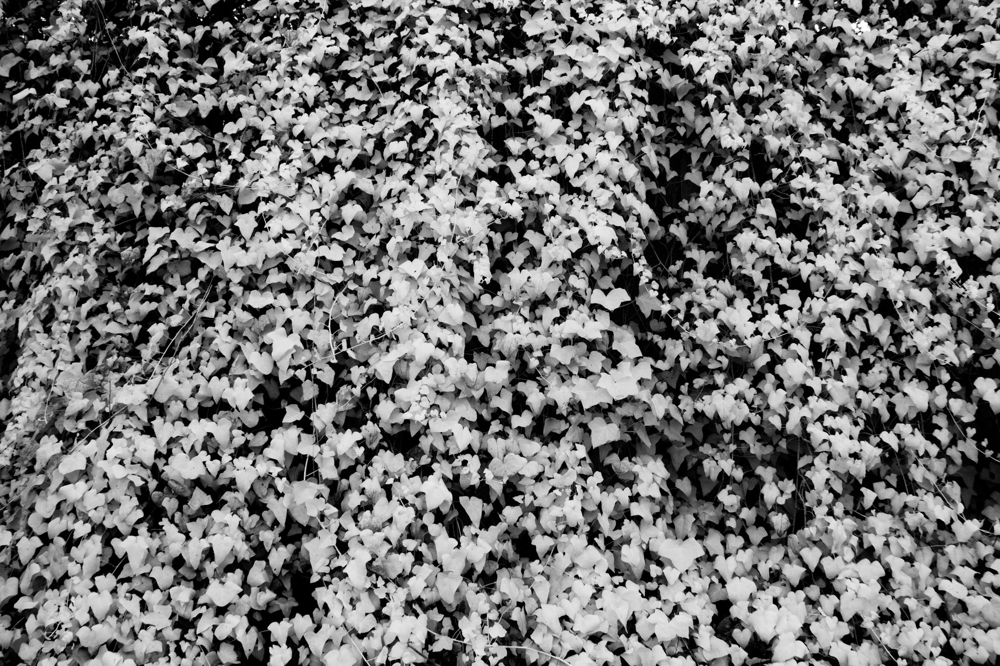
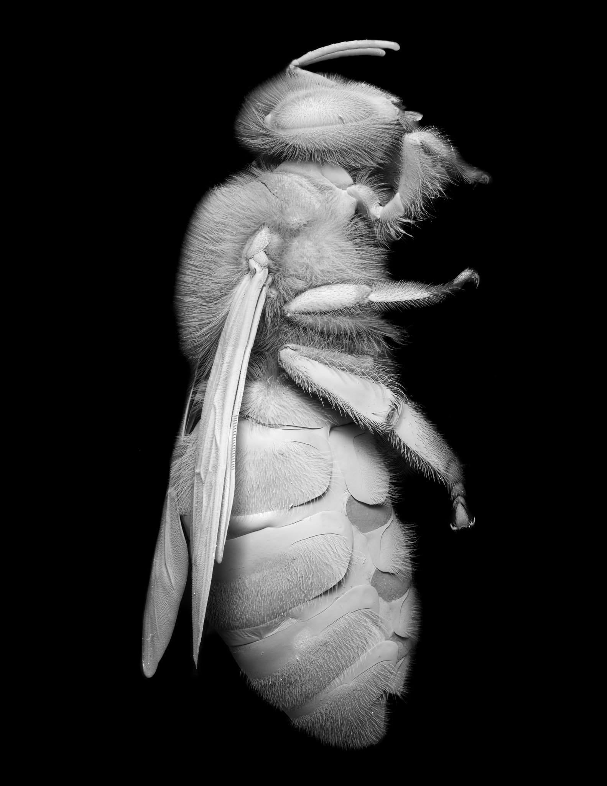
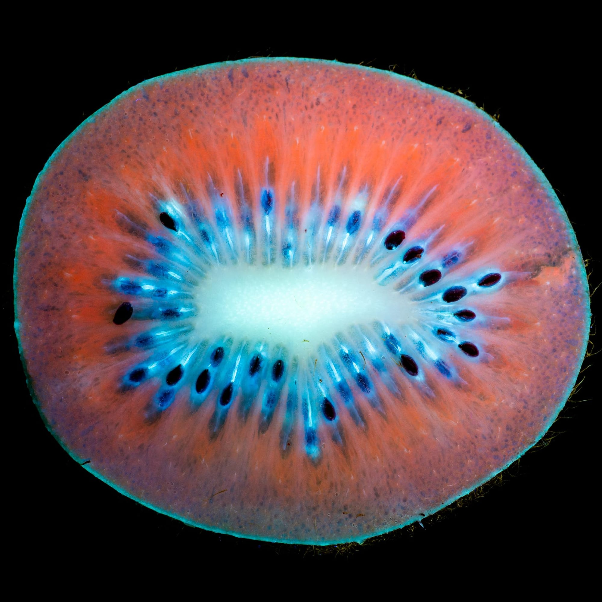
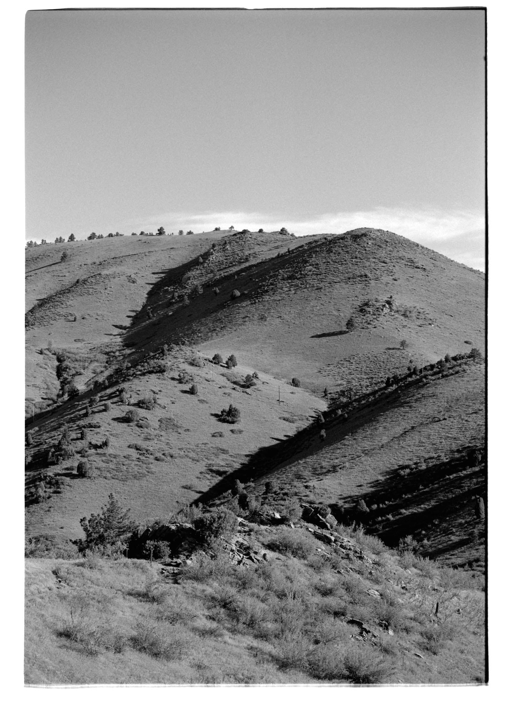
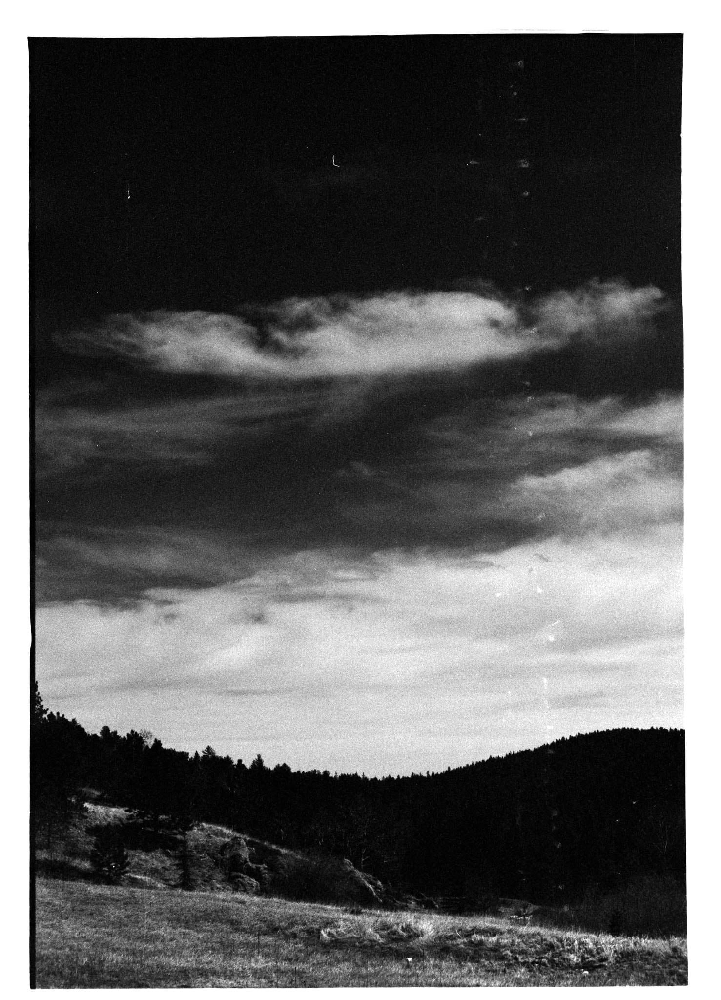

For a little over a year I have been planning a project consisting of a series of portraits of clouds. Specifically bright, fluffy, detailed clouds on a inky black sky.

## Photography and Me
When I got into photography everywhere I went I would bring a camera. I enjoyed taking lots of pictures of everything and everyone. The number of shallow depth of field "candids" I have of my friends from that time could easily fill several volumes. I would also spend hours wandering by myself in the woods trying to find interesting subjects and compositions, maybe even finding one or two sometimes.

Since I left undergrad and started working a 9-5 job I have had fewer of those walks. When I hike now I have a puppy with my who doesn't know how to slow down. Moving so fast, any photos I take feel more like snapshots of places along a trail than considered compositions.

## Past Work







Reflecting on my catalog of work, I realized that a lot of the things I was most proud of involved unconventional imaging methods. In school I did a series of portraits of Honey Bees using a scanning electron microscope. I also experimented with Ultraviolet Induced Visible Fluorescence (UVIVF) where you shine a very pure ultraviolet light source at a subject in near pitch darkness resulting in otherworldly colors. In addition to this, after watching a Ted Forbes video, I became transfixed by infrared, convincing my photography professor to let me disassemble one of her Canon 60Ds to convert it for infrared. 

Another thing all of these projects had in common was that the subjects were everyday things. Everyone had seen Ivy, been stung by a bee, and at least seen a kiwi. But, with these techniques they are transformed into what I would call art. So, as I was trying to reconcile my desire to still make photos with the constraint of this part of my life I started to search for common things which, when coupled with an interesting imaging technique, might create something at least interesting.

## Shooting Film, Again
I had first shot film seriously when I was in college using an amazing Nikon FM2 from my mom. But after the camera was stolen (I still don't exactly know how) I gave it up entirely. 

Fast forward to the beginning of 2023 and I, for some reason, decided to give it a shot again. I think in part I was reacting to some feelings of being stuck in a rut creatively with digital photography and was hoping the act of having to slow down and really think about the composition and exposure would help me find a creative outlet again. 

To a certain extent I think it worked, but what really triggered this clouds project was learning about the effect of color filters on black and white film.

## Filters
When shooting black and white film all of the color information in a scene gets squished into the single axis of black/white. Like with any lossy transformation there are many ways that this conversion can happen. A film might have less sensitivity to red for example (often called orthochromatic film) causing red objects to look very dark in the final image. Outside of film spectral sensitivity, there are other ways for photographers to adjust the look of their black and white images, the most common being the use of color filters.

Color essentially colored pieces of glass you place in front of your lens to manipulate which frequencies of light can pass through. If you remember your high school physics class you might remember that visible light is a spectrum of frequencies with blue/violet on the higher frequency end and red on the low frequency end with green in the middle. This means that using a red filter for an image will cause the greens and blues in a scene to be much darker.

For more information about how filters work you can checkout this [article from The Darkroom](https://thedarkroom.com/color-filters-with-bw-film/).







What really stood out to me when I was learning about filters was the effect that a yellow or red filter had on the darkness of the sky in a photo. As you can see in the above photo (left), usually, in a black and white photo the sky has a similar value to the foreground so the clouds have a tendency to blend into the sky. However, when you stick a yellow filter or a more extreme red filter it start to really bring down the sky value while still maintaining bright white clouds (right).

This is led me to wonder "How far can you go with this effect?". Imaging these images of clouds taken out of their normal context and  silhouetted on a black background, enabled by color filters, is what led me to the idea of doing a series of cloud portraits.

---

## Next Steps
With a subject decided on the next step is to figure out how I'm actually going to take these photos. Below I've laid out the different components I will need to create these photos including what questions I still need to answer:

- Camera: Minolta X-700 or similar
- Lens: Minolta 70-210 f/4? 85? 200?
    - Aperture Setting: TBD
- Film: Adox HR-50? Rollei Retro 80S? Adox CMS 20 ii? Agfa Copex? Ilford Delta 100? Rollei RPX 25?
- Filters: Red?, Yellow?, Polarizer?, Infrared?
- Time of day and position relative to the sun: Morning? Mid-day? Evening? Away from the Sun? 90 degrees off? Directly at the Sun?

In the next installments of this series I will systematically try to approach each of these components individually before eventually landing on my optimal setup to make the photos I'm imagining.
